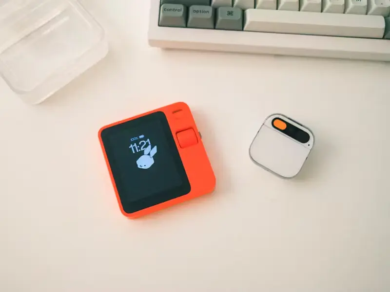

# Digit
**[ES]** Este gadget, asistente de escritorio, busca ser un dispositivo elegante, minimalista y lleno de información, diseñado para encajar perfectamente en tu escritorio moderdo. Está inspirado en las malas reviews que recibieron [pin ai](https://humane.com/) y [rabbit r1](https://www.rabbit.tech/) en su salida al mercado y se basa en gran medida en el equilibrio de lograr un buen MVP.

**[EN]** This gadget, a desktop assistant, aims to be an elegant, minimalist device filled with information, designed to seamlessly fit into your modern desk setup. It draws inspiration from the negative reviews received by [pin ai](https://humane.com/) and [rabbit r1](https://www.rabbit.tech/), and heavily emphasizes achieving a good MVP.

  

## Concepto
Es un proyecto visionario y a largo plazo que busca redefinir la interacción humana con la tecnología a través de un dispositivo inteligente portátil. Su objetivo final es crear un asistente personal que sea una extensión natural del usuario, facilitando las tareas cotidianas sin caer en la trampa de prometer más de lo que puede ofrecer en su etapa inicial.

A diferencia de sus predecesores, R1 y Pin, este dispositivo se centra en una evolución gradual y sostenida. Comienza con funciones básicas y esenciales, tales como gestos, proyección de información, y conectividad. A medida que la tecnología avanza, el dispositivo se actualizará y mejorará, incorporando nuevas capacidades y refinando su desempeño para ofrecer siempre una experiencia de usuario óptima y confiable.

El núcleo de este proyecto es la simplicidad y la eficiencia. En lugar de intentar deslumbrar con características superfluas, se enfoca en lo que realmente importa: proporcionar un rendimiento confiable, intuitivo y adaptativo. La visión detrás de este dispositivo es convertirlo en un asistente indispensable que no solo complemente nuestras vidas, sino que también nos permita interactuar con el mundo digital de una manera más humana y menos intrusiva.

Este enfoque progresivo asegura que cada nueva función se implemente con el máximo cuidado y consideración, garantizando que el dispositivo evolucione en armonía con las necesidades y expectativas de los usuarios. En resumen, es más que un simple gadget; es una promesa de futuro, donde la tecnología y la humanidad coexisten de manera sinérgica y natural.

## Funcionalidades
* Mostrar la hora hora / Dia, configurable en zonas horarias
* El clima, configurable por zonas con alertas
* Seguimiento de la cotización de la bolsa
* Reloj pomodoro (tiempo de trabajo)
* Contador de seguidores en redes sociales
* Frases / horóscopo / Efemérides
* Google calendar, avisos de reuniones
* Seguimiento de partidos, resultados deportivos
* Mascota Tamagochi
* USB a la pc para HMI
* ...

## Arquitectura
Digit es un accesorio diseñado para mejorar la productividad y personalización del entorno de trabajo en el escritorio. Este dispositivo combina hardware de última generación con la flexibilidad de firmware personalizable, permitiendo a los usuarios elegir entre cargar su propio firmware o utilizar el firmware original.

El modelo de negocio de Digit se basa en el enfoque freemium. Los usuarios pueden adquirir el dispositivo y utilizar el firmware básico de forma gratuita, obteniendo acceso a funcionalidades esenciales que optimizan la organización y eficiencia del escritorio. Aquellos que buscan características avanzadas, actualizaciones continuas y soporte prioritario podrán suscribirse a la versión Pro. Esta suscripción Pro no solo proporciona beneficios adicionales a los usuarios, sino que también financia el desarrollo constante de la API y nuevas funcionalidades, asegurando que la plataforma evolucione y mejore continuamente.

Con Digit, los usuarios pueden disfrutar de una asistencia inteligente y adaptativa directamente en su escritorio de trabajo. El dispositivo está diseñado para integrarse perfectamente en la rutina diaria, optimizando tareas, proporcionando información relevante y adaptándose a las necesidades individuales en tiempo real. La comunidad de desarrolladores también puede contribuir al proyecto, fomentando la innovación y la evolución del firmware, lo que permite que Digit se mantenga a la vanguardia de la tecnología de escritorio.

## Route map
* V0: Diseño conceptual (MVP)
* V1: Presentación como producto
* V2: API
* V3: OS
* V4: IA
* V5: Her

## Comunidad

  

